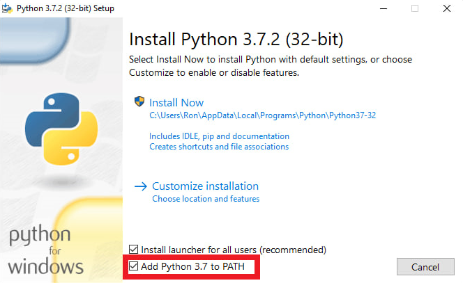

# MetaMask Vault Extractor


## Description
A secure tool to recover seed phrases and private keys from MetaMask vault data.

## Overview

This tool helps users extract important credentials from MetaMask vault files:
- Seed phrases (mnemonic)
- Private keys for imported accounts
- Associated Ethereum addresses

All sensitive data is processed locally on your machine.

## Features

- **Secure Processing**: All decryption happens locally without transmitting sensitive data
- **Multiple Password Attempts**: Try multiple passwords from a file password_list.txt
- **Cross-Platform Support**: Works on Windows, macOS, and Linux
- **Hidden Password Input**: Masks passwords during input for security
- **UTF-8 Support**: Handles passwords with special characters

## Installation

### Step 1: Install Python
1. Download Python from the official website: [https://www.python.org/downloads/](https://www.python.org/downloads/)
2. During installation, **check "Add Python to PATH"** to make Python accessible from command line



3. Verify installation by opening a terminal and running:
   ```
   python --version
   ```

### Step 2: Install Dependencies
Install required Python libraries using pip:

```bash
pip install cryptography eth-account eth-utils
```

### Step 3: Prepare Required Files
1. Open a file named vault_data.txt containing test MetaMask vault data. Replace the data, iv, and salt fields with your own vault data.
Open a file named password_list.txt, remove the test passwords, and add your own passwords (one per line). 

## Usage
1. Open a terminal and navigate to the script's directory
2. Run the script:
   ```bash
   python vault_extractor.py
   ```
3. The script will:
   - Try passwords from `password_list.txt` file
   - Fall back to manual password input if needed
   - Extract and display seed phrases and private keys
   - Save results to `decrypt_data.txt`

## Troubleshooting

- **File Not Found Errors**: Ensure `vault_data.txt` and `password_list.txt` are in the same directory as the script
- **Decryption Errors**: Check that passwords are correctly entered and the vault data is valid
- **Unicode Errors**: Make sure all files are saved with UTF-8 encoding

## Credits

Created by MetaMask Guide Luigi
If this tool helped you, consider supporting my work 
by sending a donation to my Ethereum address:
0x8A00f43C099bEB3F5d3C289e8b93c71c32B4d52e
