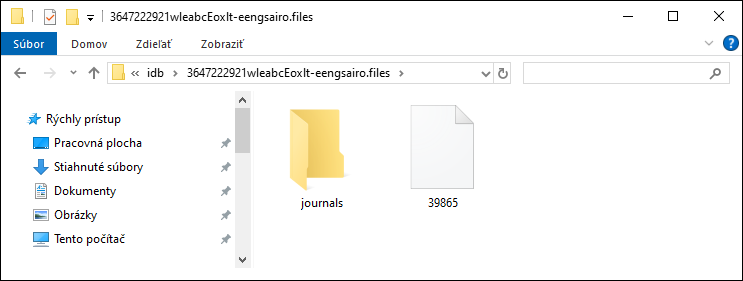

# MetaMask Vault Extractor


## Description
A secure tool to recover seed phrases and private keys from MetaMask vault data.

## Overview

This tool helps users extract important credentials from MetaMask vault files:
- Seed phrases (mnemonic)
- Private keys for imported accounts
- Associated Ethereum addresses

All sensitive data is processed locally on your machine.

## Features

- **Secure Processing**: All decryption happens locally without transmitting sensitive data
- **Multiple Password Attempts**: Try multiple passwords from a file password_list.txt
- **Cross-Platform Support**: Works on Windows, macOS, and Linux
- **Hidden Password Input**: Masks passwords during input for security
- **UTF-8 Support**: Handles passwords with special characters

## Installation, Find Data and Usage

### Step 1: Install Python
1. Download Python from the official website: [https://www.python.org/downloads/](https://www.python.org/downloads/)
2. During installation, **check "Add Python to PATH"** to make Python accessible from command line


3. Verify installation by opening a terminal and running:
   ```
   python --version
   ```

### Step 2: Install Dependencies
Install required Python libraries using pip:

```bash
pip install cryptography eth-account eth-utils
```
### Step 3: Find Your MetaMask Vault Data

To create `vault_data.txt`, you need your MetaMask vault data (JSON with `data`, `iv`, `salt`). MetaMask stores this in your browser’s local storage as `.ldb` files (LevelDB). Here’s where to find them on your PC:

- Enable **Show hidden files** in your file explorer to access these paths:
  - **Windows (Chrome)**: `C:\Users\YOUR_USERNAME\AppData\Local\Google\Chrome\User Data\Default\Local Extension Settings\nkbihfbeogaeaoehlefnkodbefgpgknn`
  - **Windows (Firefox)**: `C:\Users\XXXX\AppData\Roaming\Mozilla\Firefox\Profiles\XXXXXXX.default-release\storage\default\moz-extension+++XXXXX-XXXXX-XXXXX-XXXX-XXX^userContextId=XXXXXX\idb\3647222921wleabcEoxlt-eengsairo.files`
  - **macOS (Chrome)**: `~/Library/Application Support/Google/Chrome/Default/Local Extension Settings/nkbihfbeogaeaoehlefnkodbefgpgknn`
  - **Linux (Ubuntu, Chrome)**: `~/.config/google-chrome/Default/Local Extension Settings/nkbihfbeogaeaoehlefnkodbefgpgknn`
- Look for a file like `000003.ldb`, `000478.log` or similar (number can be higher). Open it with <a href="https://notepad-plus-plus.org/downloads/" target="_blank" rel="noopener noreferrer">Notepad++</a> or use <a href="https://www.emeditor.com/" target="_blank" rel="noopener noreferrer">EmEditor Free</a> to find the JSON vault data (containing `data`, `iv`, `salt`).

 
- **Firefox Browser** it stores this data in a file with a number (e.g., `39865`)

 

### Step 4: Prepare Required Files
1. Open a file named vault_data.txt containing test MetaMask vault data.
Replace the **`data`**, **`iv`**, and **`salt`** fields with your own vault data.
- Field Formats:
     - **`data`**: Base64-encoded string of encrypted vault data, typically 500–2000+ characters, depending on the vault’s contents.
     - **`iv`**: Base64-encoded initialization vector, usually 16 bytes (~24 characters, including `=` padding).
     - **`salt`**: Base64-encoded salt, standardly 32 bytes (~44 characters, including `=` padding).
   - Ensure the file is saved in **UTF-8 encoding** to avoid decoding errors.
2. Open a file named password_list.txt, remove the test passwords and add your own passwords (one per line). 

## Usage
1. Open a terminal and navigate to the script's directory. For Windows users, you can simply type `cmd` in the address bar of the script’s folder and press Enter to open a Command Prompt in that directory.
2. Run the script:
   ```bash
   python vault_extractor.py
   ```
3. The script will:
   - Try passwords from `password_list.txt` file
   - Fall back to manual password input if needed
   - Extract and display seed phrases and private keys
   - Save results to `decrypt_data.txt`

## Security Notes

- **Secure Storage**: Store `vault_data.txt`, `password_list.txt`, and `decrypt_data.txt` securely, as they contain sensitive information (seed phrases and private keys).
- **Offline Environment**: For maximum security, I recommend running this tool on a **live Ubuntu USB** without an internet connection. This minimizes the risk of malware or network attacks exposing your seed phrases or private keys. Boot into a live Ubuntu session, copy the script and input files to the USB, and run the tool offline. Stay safe! 😄

## Troubleshooting

- **File Not Found Errors**: Ensure `vault_data.txt` and `password_list.txt` are in the same directory as the script
- **Decryption Errors**: Check that passwords are correctly entered and the vault data is valid
- **Unicode Errors**: Make sure all files are saved with UTF-8 encoding

## Support the Creator

Built with ❤️ by MetaMask Guide Luigi!  
Love this tool? Show some support by sending a donation to my Ethereum address: `0x8A00f43C099bEB3F5d3C289e8b93c71c32B4d52e`. 
Every little bit helps me keep creating cool stuff! 😄
